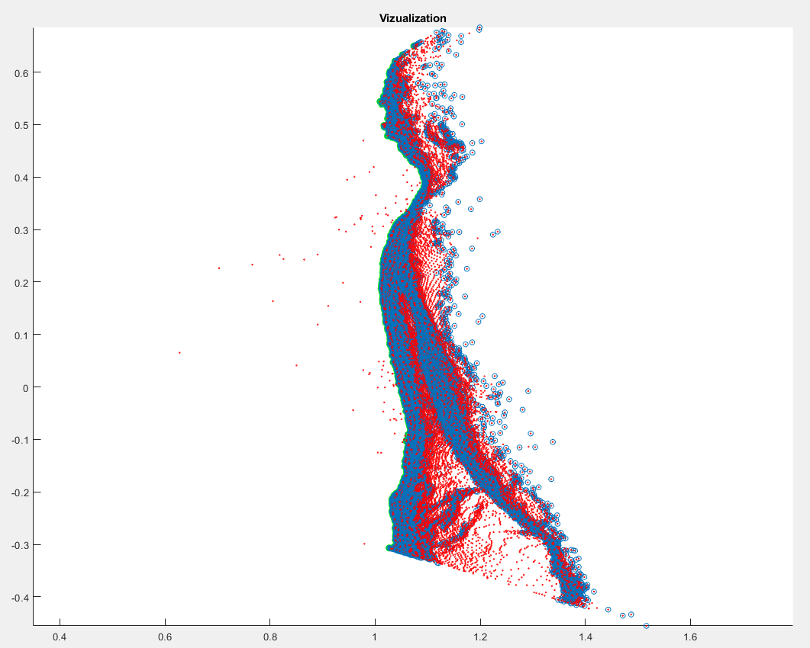

# Back Curvature From File
## Overview
This program is meant to be used for testing purposes when you want to study the date more thoroughly. It uses the unfiltered data from [this Kinect-based back tracker project](https://github.com/vitaliy1919/kinect-back-curve-detector) to filter it, detect spine points and visualize the data.

**Note:** the algorithm currently used in this project is the same as in the aforementioned back tracker project.

## Usage

Run  [this project](https://github.com/vitaliy1919/kinect-back-curve-detector) with constant `debugData` set to `true`. Then open the `write.txt` file, choose the frame you want to analyze, copy it to another file (without first and last line about frame start and frame end). And then use the new file as an input for this project (you need to change constant in the main function to the name of your file). Four txt files with data are in the folder `Back Curvature From File`, you may start with them.

After you run this application 3 new files will be generated - `points.txt`, `points_filtered`, `spine_points.txt`. 

In order to visualize data from these files you need to run `visualize_points.m` with MatLab or Octave.

Example of output:

